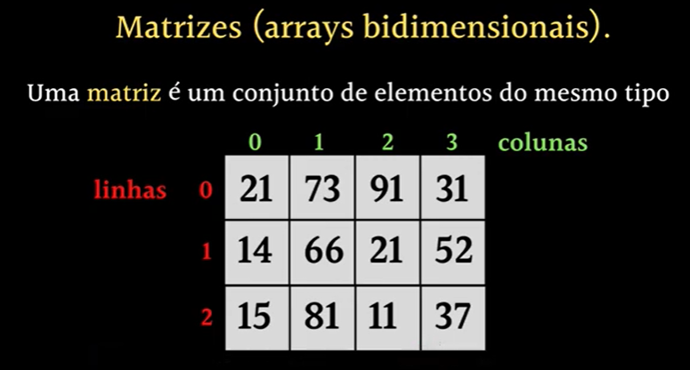
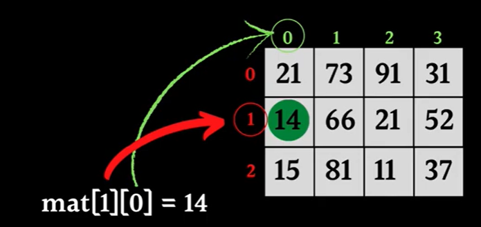

# ARRAYS BIDIMENSIONAIS - MATRIZES

São estruturas de dados que armazenam **elementos do mesmo tipo** em uma grade ou tabela, acessados por índices múltiplos. A matriz mais comum é a bidimensional (2D), que pode ser visualizada como linhas e colunas, mas C suporta matrizes com mais dimensões.

## PRINCIPAIS CARACTERISTICA

- Todos os elementos têm o mesmo tipo (ex.: int, float, char).
- O tamanho de cada dimensão é fixo na declaração (a menos que seja alocado dinamicamente).
- Os elementos são armazenados em memória de forma contígua, em ordem de linha (row-major order).

## DECLARAÇÃO & INICIALIZAÇÃO

~~~c
tipo nome_matriz[num_linhas][num_colunas];
~~~

~~~c
int matriz[3][4]; // Uma matriz 3x4 (3 linhas, 4 colunas)
~~~

A inicialização de valores pode ser feita no momento da declaração

~~~c
int matriz[2][3] = {
    {1, 2, 3}, // Linha 0
    {4, 5, 6}  // Linha 1
};
~~~

Ou parcialmente (os elementos não especificados são preenchidos com 0)
~~~c
int matriz[2][3] = {{1, 2}, {4}}; // Resultado: {{1, 2, 0}, {4, 0, 0}}
~~~