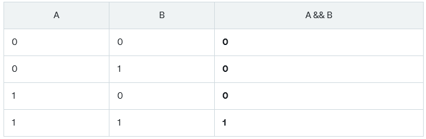
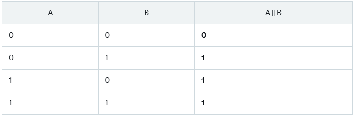
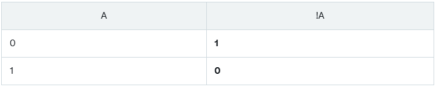

# OPERADORES LÓGICOS

Os operadores lógicos são usados para realizar operações booleanas (verdadeiro ou falso) em expressões condicionais. Eles geralmente são usados dentro de estruturas de decisão, como ``if, while e for.``

## OPERADORES

### OPERADOR E (&&)

Use ``&&`` quando todas as condições precisam ser verdadeiras

Sintaxe: `expressão1 && expressão2`

 

Exemplo prático:

~~~c
#include <stdio.h>

int main(){
    int idade = 20;
    int possui_habilitacao = 1; // 1 representa verdadeiro (true)

    if (idade >= 18 && possui_habilitacao) {
        printf("Pode dirigir.\n");
    } else {
        printf("Não pode dirigir.\n");
    }

    return 0;
}
~~~
 

### OPERADOR OU ( || )
Use ``||`` quando pelo menos uma das condições precisa ser verdadeira

Sintaxe: `expressão1 || expressão2`

 

Exemplo prático:

~~~c
#include <stdio.h>

int main(){
    int tem_senha = 0;
    int tem_digital = 1;

    if (tem_senha || tem_digital) {
        printf("Acesso permitido.\n");
    } else {
        printf("Acesso negado.\n");
    }

    return 0;
}
~~~

 

### OPERADOR NEGAÇÃO ( ! )
Use `!` para inverter valores booleanos

Sintaxe: `!expressão`

 

Exemplo prático:

~~~c
#include <stdio.h>

int main(){
    int chovendo = 0; // 0 representa falso

    if (!chovendo) {
        printf("Vou sair para caminhar.\n");
    } else {
        printf("Vou ficar em casa.\n");
    }

    return 0;
}
~~~

 

