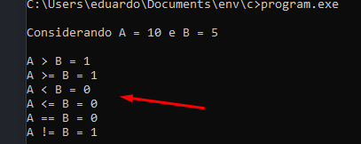

# OPERADORES RELACIONAIS

Os operadores relacionais na linguagem C são usados para comparar valores. Eles retornam 1 (``true``) se a condição for verdadeira, e 0 (``false``) se for falsa.

### **Principais Operadores Relacionais em C**
| Operador  | Descrição                         | Exemplo (`a = 10`, `b = 5`) |
|-----------|----------------------------------|------------------------------|
| `==`      | Igual a                          | `a == b` → `0` (falso)       |
| `!=`      | Diferente de                     | `a != b` → `1` (verdadeiro)  |
| `>`       | Maior que                        | `a > b` → `1` (verdadeiro)   |
| `<`       | Menor que                        | `a < b` → `0` (falso)        |
| `>=`      | Maior ou igual a                 | `a >= 10` → `1` (verdadeiro) |
| `<=`      | Menor ou igual a                 | `b <= 5` → `1` (verdadeiro)  |

---

*OBS: não confunda o operador de igualdade (==) com o operador de atribuição (=)*

Exemplo
~~~c
#include <stdio.h>

int main(int argc, char const *argv[]) {

  int a = 10, b = 5;

  printf("\nConsiderando A = %d e B = %d \n", a, b);
  printf("\nA > B = %d", a > b);
  printf("\nA >= B = %d", a >= b);
  printf("\nA < B = %d", a < b);
  printf("\nA <= B = %d", a <= b);
  printf("\nA == B = %d", a == b);
  printf("\nA != B = %d", a != b);

  printf(" \n");
  return 0;
}
~~~

Saida  

