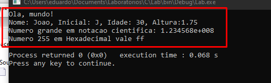

# FUNÇÃO PRINTF

A função `printf` é utilizada para saída de dados. 
Faz parte da biblioteca padrão de C, especificamente da `<stdio.h>` (Standard Input/Output). O nome `printf` é uma abreviação de *print formatted*, indicando sua função de imprimir texto formatado.

## COMO USAR

Para usar a função lembre-se de importar a biblioteca `<stdio.h>`. A sintaxe básica da função é:

`printf("formato", arg1, arg2,...);`

**FORMATO**: pode conter textos literais ou especificadores de formatos específicos.

**ARG**: Valores que substituem os especificadores de formato na string de formato


| Especificador | Tipo de dado | Exemplo |
|--------------|------------|---------|
| `%d` ou `%i` | Inteiro (int) | `printf("%d", 42);` |
| `%f` | Float ou Double | `printf("%.2f", 3.1415);` |
| `%c` | Caractere (char) | `printf("%c", 'A');` |
| `%s` | String (char[]) | `printf("%s", "Texto");` |
| `%x` | Hexadecimal | `printf("%x", 255); // ff` |
| `%p` | Ponteiro (endereço de memória) | `printf("%p", ptr);` |
| `%e` | Notação cientifica | `printf("%e", 123456789.123456789);` |

**CARACTERES DE ESCAPE**: 
Caracteres como `\n` (nova linha) ou `\t` (tabulação) podem ser usados dentro da string de formato para controlar a saída.

Veja a seguir um exemplo de como usar. *Ignore a tipagem e definição das variáveis e foque somente em como usar o printf*


Código
~~~c
#include <stdio.h> // importa a biblioteca Standard Input/Output

int main()
{
    int idade = 30;
    float altura = 1.75;
    char inicial = 'J';
    char nome[] = "Joao";

    // Saída de texto simples
    printf("Ola, mundo! \n");

    // Formatação de variáveis
    printf("Nome: %s, Inicial: %c, Idade: %d, Altura:%.2f \n", nome, inicial, idade, altura);

    // Uso de notação científica
    float numeroGrande = 123456789.123456789;
    printf("Numero grande em notacao cientifica: %e \n", numeroGrande);

    // Hexadecimal
    printf("Numero 255 em Hexadecimal vale %x \n", 255); // provável saída: ff

    return 0;
}
~~~
Saída


**Notas importantes**
 - O `%.2f` limita a exibição para 2 casas decimais.
 - Evite usar printf com dados não confiáveis (como entrada do usuário) sem sanitização, pois pode ser vulnerável a ataques como formatação de string.


## CURIOSIDADES

A função `printf()` retorna um valor: ela retorna o número de caracteres impressos.

~~~c
int n = printf("Teste");
printf("\nCaracteres impressos: %d\n", n)

/* Saida

Teste
Caracteres impressos: 5

*/
~~~

Para imprimir `%` use `%%` 
   ```c
   printf("Taxa de sucesso: 99%%\n");
   ```

Cuidado com `printf()` sem argumentos suficientes  
   ```c
   printf("Valor: %d\n"); // ERRO! Falta um número
   ```
   Isso pode gerar **comportamento inesperado** ou **crash**.
