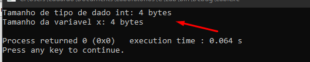

# OPERADOR SIZEOF

O operador `sizeof` é usado para determinar o tamanho **em bytes** de tipos de dados e variáveis, o que é crucial em uma linguagem onde o gerenciamento de memória é feito manualmente pelo programador. O `sizeof` é uma palavra-chave e não uma função, o que significa que ele é avaliado em tempo de compilação para expressões constantes e em tempo de execução para variáveis.

## QUANDO USAR

 - **Alocação Dinâmica de Memória**: Para alocar a quantidade correta de memória usando malloc ou outras funções de alocação de memória.
 - **Manipulação de Estruturas**: Para calcular o tamanho de estruturas ou arrays, especialmente dinâmicos ou de tamanho variável.
 - **Portabilidade**: Para escrever código que seja independente do tamanho específico dos tipos de dados, que pode variar entre diferentes sistemas ou arquiteturas.
 - **Depuração**: Para verificar o tamanho de tipos ou variáveis para fins de diagnóstico ou otimização.

## COMO USAR

 A sintaxe básica do operador é:

`sizeof(<tipo de dado ou variavel>)`

~~~c
sizeof(tipo)      // Obtém o tamanho de um tipo de dado
sizeof(variável)  // Obtém o tamanho da variável
~~~

**OBSERVAÇÕES IMPORTANTES**
 - ``sizeof`` retorna ``size_t``, que é um tipo não assinado definido para representar tamanhos de objetos em memória.
 - ``%zu`` é usado no ``printf`` para formatar ``size_t`` corretamente.

Para exemplificar melhor, observe o código abaixo

~~~c
#include <stdio.h>

int main() {
    int x;
    printf("Tamanho de tipo de dado int: %zu bytes\n", sizeof(int));
    printf("Tamanho da variável x: %zu bytes\n", sizeof(x));
    return 0;
}
~~~

Saída  

Repare que o tamanho do tipo int possui 4 bytes de tamanho e de acordo com as [unidades de medida](./unidades%20de%20medidas.md) esse tipo de dado consome 32 bits de espaço em memória 