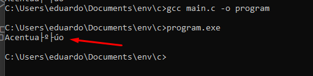
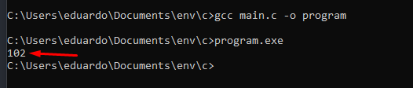

# TABELA ASCII e ACENTUAÇÃO

## ACENTUAÇÃO

Se você tentar usar acentuação em seus programas, compilar e executar provalvemente vai se deparar com alguns caracteres esquisitos na saída do terminal. Como mostrado abaixo:

~~~c
#include <stdio.h>

int main() {
  printf("Acentuação \n");
  return 0;
}
~~~

Saída  

Isso acontece especificamente no sistema Windows e tem tudo haver com a tabela ASCII

## TABELA ASCII

A Tabela [ASCII](https://pt.wikipedia.org/wiki/ASCII) (**A**merican **S**tandard **C**ode for **I**nformation **I**nterchange) é usada pela maior parte da industria de computadores para a troca de informações. Cada caractere é representado por um código de 8 bits (um byte)

 

O computador usa a tabela ascii como forma de conversão dos caracteres digitados para binário. Vamos fazer um exemplo prático

Execute o seguintes códigos em sua máquina

~~~c
#include <stdio.h>

int main() {
  char letra = 'f'
  printf("%d", letra);
  return 0;
}
~~~
Você deve estar se perguntando "porque você usou um %d para formatar a saída de um char? Vai dar erro." Bom na verdade, após executar o programa a saída será essa:

Agora execute o seguinte código
~~~c
#include <stdio.h>

int main() {
  printf("%c", 102);
  return 0;
}
~~~

Você deve estar se perguntando "não vai dar erro formatar um numero inteiro como %c ?" Bom na verdade, após executar o programa a saída será essa:

Você já deve ter percebido o que está acontecendo. O nosso programa na verdade está usando a tabela ASCII

https://pt.wikipedia.org/wiki/ASCII

